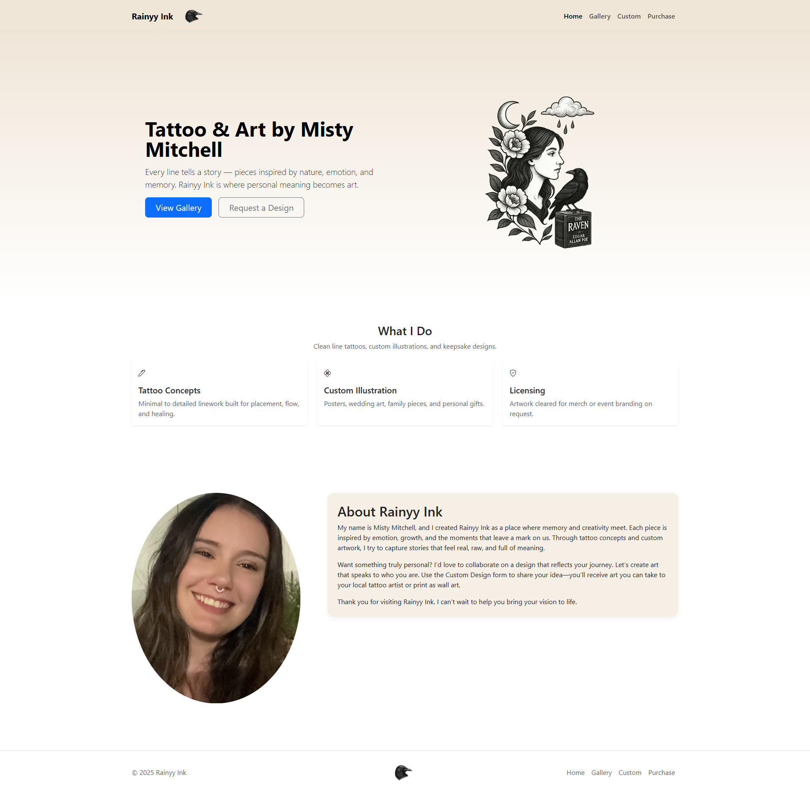
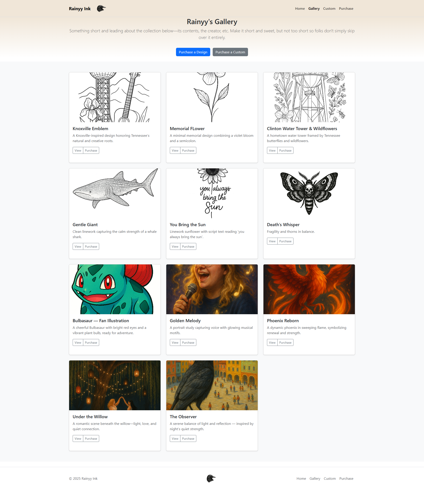
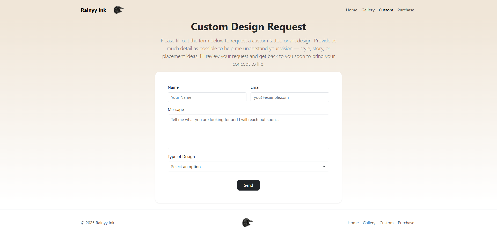

# Rainyy Ink

This is my first full website project built for my art and tattoo designs.  
I made this to show my work, including original pieces, custom request options, and ways for people to contact me.  
Everything was designed and coded by me using HTML, CSS, and Bootstrap.

---

## Overview

Rainyy Ink is a responsive website that includes:
- A home page that introduces my work  
- A gallery page showing finished tattoo and art designs  
- A custom page where people can request new designs  
- A contact page for anyone who wants to purchase a piece  

This project was built to practice front-end development skills while keeping the layout simple and easy to use.

---

## Website Screenshots

### Home Page


### Gallery Page


### Custom Page


### Contact Page

---

## How to View

1. Download or clone this repository:
   ```bash
   git clone https://github.com/MistyMirandaM/Project1.git
   ```
2. Open the `index.html` file in your web browser to view the homepage.  
3. Use the navigation links at the top (Home, Gallery, Custom, Contact) to explore the site.  

---

## Built With
- HTML  
- CSS  
- Bootstrap 5  

---

## What I Learned
- How to organize multiple web pages into one project  
- How to use Bootstrap for faster, responsive layouts  
- How to link pages, use navbars, and style forms  
- How to prepare and format images for a gallery section  

---

## Future Improvements
- Add animations or hover effects to images  
- Improve the mobile layout even more  
- Connect the form to an email or backend  
- Add a light/dark theme switch  

---

## About Me
**Misty Mitchell**  
Student, Artist, and Front-End Developer in training  

Every line tells a story — pieces inspired by nature, emotion, and memory.

---

### Project Files
- `index.html`  
- `gallery.html`  
- `custom.html`  
- `contact.html`  
- `styles.css`

---

© 2025 Rainyy Ink. All rights reserved.
